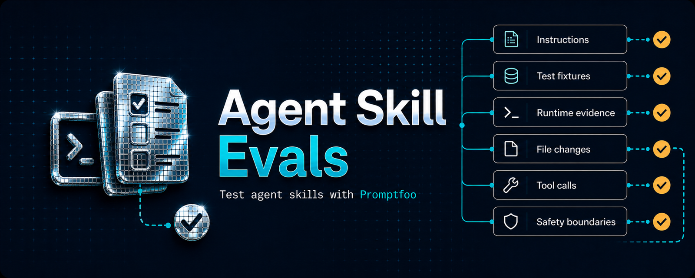

<p align="center">
  
</p>

# Agent Skill Evals

[](https://skills.sh/akshay5995/agent-skill-evals)

Test whether reusable instructions for AI agents actually work.

An agent skill is a reusable playbook that tells an AI agent how to perform a task. Agent Skill Evals lets you give that skill realistic jobs, run them with real agents, and verify what actually happened. Unlike general model or application evals, the skill itself is the product under test.

Agent Skill Evals gives [Promptfoo](https://www.promptfoo.dev/) the skill-aware setup, static checks, isolated test environments, and runtime assertions needed to answer two questions:

1. Is the skill clear and testable before an agent runs?
2. Did the agent load the right skill and produce the expected result?

Promptfoo stays the runner and reporting UI. You keep using `promptfoo eval`.

## Before You Start

Install and authenticate at least one supported agent CLI: [Codex CLI](https://help.openai.com/en/articles/11096431), [Claude Code](https://docs.anthropic.com/en/docs/claude-code/getting-started), or [Pi](https://github.com/earendil-works/pi/blob/main/packages/coding-agent/docs/quickstart.md). The adapter selected by `init` runs that external CLI; installing the npm packages alone is not enough for a runtime eval.

## Quick Start

Install Agent Skill Evals and Promptfoo:

```sh
pnpm add -D agent-skill-evals promptfoo
```

Scaffold an eval for a skill and choose the agent you want to test:

```sh
pnpm exec agent-skill-evals init \
  --skill ./skills/bugfix-workflow \
  --adapter codex
```

The supported adapters are `codex`, `claude-code`, and `pi`. The command creates a Promptfoo config and a starter Test Pack; it does not create fake agents or fixtures.

Check the skill and Test Pack locally, without invoking an agent:

```sh
pnpm exec agent-skill-evals check ./skills/bugfix-workflow
```

Replace the TODO case in the generated Test Pack with a real task, then run it through Promptfoo:

```sh
pnpm exec promptfoo eval
```

## What a Test Looks Like

A Test Pack is ordinary YAML. This case starts from a fixture, confirms the bug exists, runs the agent in an isolated copy, and checks both the result and the allowed change scope:

```yaml
skill: ../skills/bugfix-workflow
tests:
  - description: fixes the login redirect
    prompt: Fix successful logins so they go to /dashboard.
    fixture: ../fixtures/login-bug
    preconditions:
      - verifier.fails: { run: ./verify_login_redirect.sh }
    expect:
      - verifier.succeeds: { run: ./verify_login_redirect.sh }
      - file.changes_within: { paths: [app.js] }
```

Each case gets a fresh World containing its fixture and an isolated skill set. Behavior cases include the target and any supporting skills. Routing cases include the target, declared distractors, and a generated neutral distractor by default. When a case fails, Agent Skill Evals points you to the retained World and `evidence.json` so you can inspect what actually happened.

## What You Can Prove

Runtime checks can assert:

- verifier success or failure;
- file existence, creation, content, unchanged state, and allowed change scope;
- whether tools were called, their order, and call counts;
- whether expected or unrelated skills were loaded;
- final-output content and turn counts;
- token budgets.

The evidence also records command results, run details, and runtime identity for debugging.

Cases can be single-turn behavior tests, routing tests with distractor skills, or multi-turn conversations with scripted or simulated users. HTTP, command, and MCP mocks run at their real protocol boundaries when a test needs controlled external systems.

## How the Pieces Fit Together

- `agent-skill-evals init` creates the minimal Promptfoo workspace and starter Test Pack.
- `agent-skill-evals check` performs fast, agent-free validation of the skill and tests.
- `promptfoo eval` runs the selected real agent and reports the results.
- Agent Skill Evals records evidence and grades the skill-specific runtime assertions.

There is no second eval runner and no private-intent inference. Routing tests must observe that the expected skill was loaded and unrelated skills were not loaded before task success counts.

## Documentation

- [Getting Started](./docs/guide/getting-started.md) walks through the first working eval.
- [Reference](./docs/guide/reference.md) covers Test Packs, Worlds, role play, mocks, runtime checks, evidence, and budgets.
- [Runnable examples](./examples) exercise the same Test Pack across Codex, Claude Code, and Pi.
- [Promptfoo documentation](https://www.promptfoo.dev/docs/intro/) covers Promptfoo configuration, filtering, caching, output, and its web UI.

## Install Agent Skill Evals

To let your agent set up an evaluation for an existing skill, install the bundled `agent-eval-skills` skill from [skills.sh](https://skills.sh/akshay5995/agent-skill-evals):

```sh
npx skills add akshay5995/agent-skill-evals
```

This installs the authoring workflow for creating an eval. The `agent-skill-evals` and `promptfoo` packages still provide the static checks and runtime evaluation.

## Development

This repository uses the Node version in `.nvmrc` and pnpm:

```sh
pnpm install
pnpm test
pnpm run typecheck
pnpm run build
pnpm run docs:build
```
